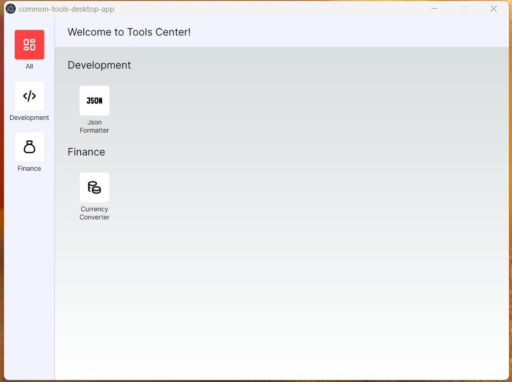
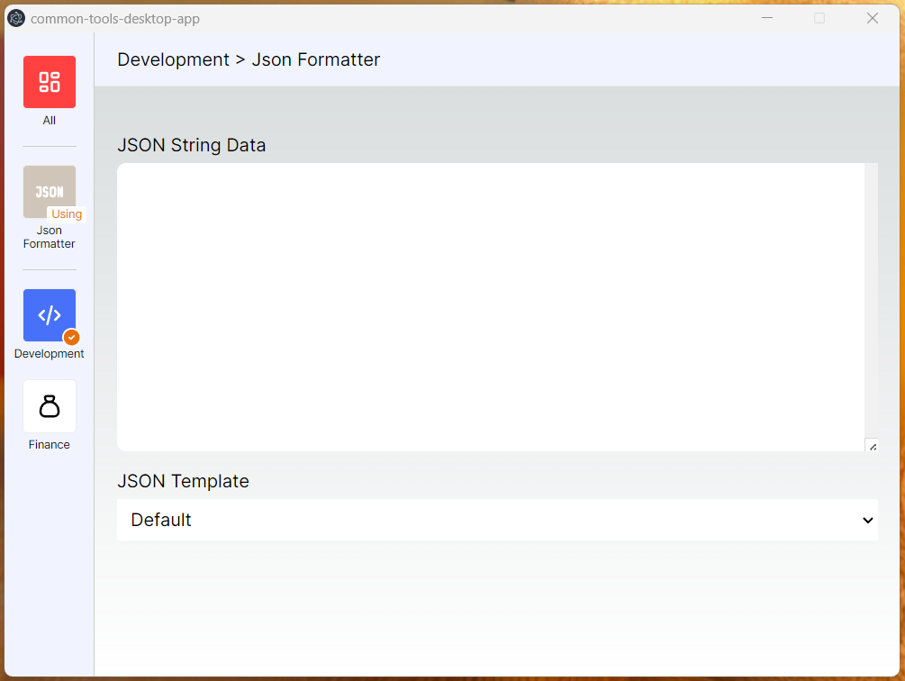

# Common Tools Desktop App - MyDailyTools

This open-source project serves as a container for Electron.js applications. Contributors can add tools to this project by creating a folder in the `src/pages/tools` directory. Each tool should have an `index.tsx` file serving as its entry point.

| Home Page                         | Tool Page                         |
| --------------------------------- | --------------------------------- |
|  |  |

## Contributing

Contributions to add new tools to this project are welcome! To contribute:

1. Fork the repository.
2. Create a new folder in the `src/pages/tools` directory for your tool.
3. Inside the tool folder, create an `index.tsx` file as the entry point for your tool.
4. Update the `toolsData` object in `src/tools_data.tsx` to include information about your tool.

Only pull requests with fully-functional tools will be accepted.

## Existing Tools

- **Currency Converter** (Under Development)
  - Description: Tool for converting between different currencies.
- **JSON Formatter** (Under Development)
  - Description: Tool for formatting JSON data in a readable manner.

## Adding a Tool

To add a new tool to this project, follow these steps:

1. **Create a Tool Folder**:

   - Navigate to the `src/pages/tools` directory.
   - Create a new folder for your tool.

2. **Create Entry Point**:

   - Inside the tool folder, create an `index.tsx` file.
   - This file will serve as the entry point for your tool.

3. **Update `toolsData` Object**:

   - Open `src/tools_data.tsx`.
   - Add an entry for your tool in the `toolsData` object, providing information such as the tool name, description, and any other relevant details.

4. **Test Your Tool**:

   - Run the application to ensure your tool works as expected.
   - You can run the application using the following commands:
     ```bash
     npm install
     npm run dev
     ```

5. **Submit a Pull Request**:
   - Once your tool is ready, submit a pull request to have it added to the project.

## License

This project is licensed under the [MIT License](LICENSE). Feel free to use and modify it as needed.

## Acknowledgements

- This project was made possible by the Electron.js community.
- Special thanks to all contributors for their valuable contributions.

## Support

If you encounter any issues or have any questions, feel free to [open an issue](https://github.com/lonixchu-hk/MyDailyTools/issues) on GitHub. We're here to help!
